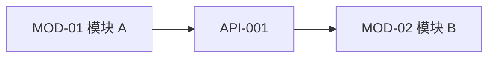
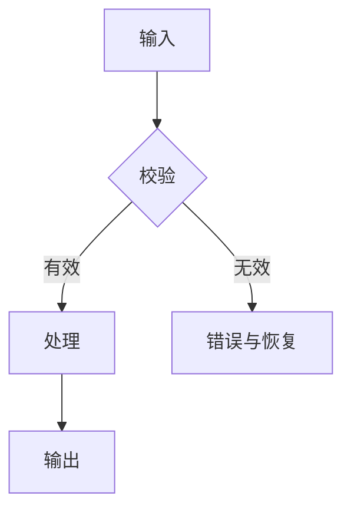
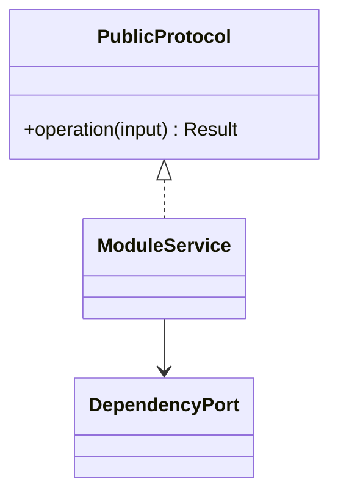
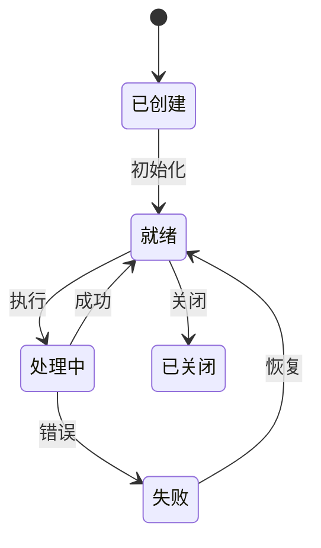

# <软件/模块名称> 软件设计说明书

> 文档编号：
> 目标软件版本/基线：
> 状态：草案 / 评审中 / 已批准
> 架构/设计负责人：待定
> 开发、测试、需求代表：待定
> 最后更新：YYYY-MM-DD

## 文档控制

| 控制项 | 内容 |
|---|---|
| 文档编号 | SDD-<PROJECT>-001 |
| 当前版本 | v0.1 |
| 当前状态 | 草稿 / 拟议 / 评审中 / 已批准 |
| 需求基线 | SRS 文档、版本与状态 |
| 高层架构 | ARCH 文档、版本与状态 |
| 决策负责人 |  |
| 适用范围 |  |
| 编码与时间约定 | UTF-8；需要持久化时间时写明时区约定 |

### 审批记录

| 角色 | 姓名 | 结论 | 日期 | 备注 |
|---|---|---|---|---|
| 架构/设计负责人 | 待定 | 待审批 |  |  |

### 变更记录

| 版本 | 日期 | 变更内容 | 受影响需求/模块/API/测试 | 决策人 |
|---|---|---|---|---|
| v0.1 | YYYY-MM-DD | 初稿 |  | 待定 |

## 1. 设计概述

### 1.1 编写目的与范围

- 本文档负责：
- 本文档不负责：
- 目标读者与下游用途：

### 1.2 设计输入与基线

| ID | 文档/代码/标准 | 版本/位置 | 本设计使用范围 | 状态 |
|---|---|---|---|---|
| REF-001 | 软件需求规格说明书 |  |  | 已批准/待确认 |

### 1.3 术语、类型与缩略词

| 名称 | 定义/语义 | 单位/坐标系/编码 | 来源 |
|---|---|---|---|
|  |  |  |  |

#### 1.3.1 设计代号及边界

列出实际使用的 SRS 与 SDD/ARCH 代号、英文全称、中文名称和边界。稳定 ID 不因章节调整而复用或改义；明确 `INT-*` 是“接口必须满足什么”的需求合同，`API-*` 是“接口具体如何实现”的函数、路由、消息、文件或端口设计。

| 代号 | 英文全称 | 中文名称 | 指代内容与使用规则 | 示例 |
|---|---|---|---|---|
| MOD / SM | Module / Submodule | 模块/子模块 | SRS/SDD 责任与功能归属视图 | MOD-01 / SM-01-01 |
| INT | Interface Requirement | 接口需求 | SRS 边界合同 | INT-001 |
| API | Application Programming Interface | 设计接口 | 实现 INT 或内部端口的具体设计 | API-001-1 |
| DATA-DES / FLOW / ERR / CFG / DEP / ADR | Design identifiers | 数据/流程/错误/配置/部署/决策设计 | 下游设计追踪标识，不新增 SRS 行为 | DATA-DES-001 |

### 1.4 约束、假设与开放决策

| ID | 类型 | 内容 | 来源/理由 | 影响设计元素 | 负责人 | 关闭证据 | 状态 |
|---|---|---|---|---|---|---|---|
| Q-001 | 开放决策 |  |  |  | 待定 |  | 待处理 |

### 1.5 软件设计技术栈

技术表必须区分当前证据、目标设计角色和批准状态。现有实现不是永久约束，推荐技术也不是已批准事实。

| 层/能力 | 当前实现证据 | 目标设计角色 | 状态、约束与替换条件 |
|---|---|---|---|
| 语言/运行时 |  |  | 当前事实 / 拟议 / 已批准约束 |
| 用户界面/Web/接口 |  |  |  |
| 应用与领域边界 |  |  |  |
| 数据与持久化 |  |  |  |
| 测试、构建与部署 |  |  |  |

## 2. 总体设计

### 2.1 系统上下文与边界


### 2.2 模块与依赖设计



| MOD-ID | 模块 | 核心责任 | 不负责 | 提供接口 | 依赖接口 | 拥有数据/资源 | 生命周期 |
|---|---|---|---|---|---|---|---|
| MOD-01 |  |  |  |  |  |  |  |

#### 2.2.1 SRS 模块、子模块与接口函数对应关系

每个 SRS 子模块必须恰有一个所有权行，并映射到一个或多个真实函数表，或明确说明为何只有内部端口/适配而不需要独立外部接口。`直接`、`组合`、`内部适配`必须如实标注；Shell、Facade、Controller、Gateway 或 Bridge 不能代替缺失的领域接口。

| SRS 模块 | SRS 子模块 | 对应 SRS 接口/无独立接口理由 | SDD 接口/具体函数表 | 对应关系与边界 | 覆盖状态 |
|---|---|---|---|---|---|
| MOD-01 | SM-01-01 | INT-001 | API-001-1 | 直接：说明提供者、调用者和所有权边界 | 已覆盖 |

### 2.3 运行、进程、线程与部署

| DEP-ID | 进程/线程/设备/部署单元 | 职责 | 启停顺序 | 资源预算 | 故障与恢复 | 约束 |
|---|---|---|---|---|---|---|
| DEP-01 |  |  |  |  |  |  |

### 2.4 总体数据与控制流



### 2.5 横切设计摘要

| 关注点 | 总体策略 | 详细章节/ADR | 验证 |
|---|---|---|---|
| 错误与恢复 |  |  |  |
| 配置 |  |  |  |
| 日志与诊断 |  |  |  |
| 安全 |  |  |  |
| 性能与资源 |  |  |  |
| 兼容与升级 |  |  |  |

## 3. 模块详细设计

> 对每个实质模块复制以下 3.x 七段结构。公共类型、运行环境和约束只定义一次，模块通过 ID 引用。

### 3.1 <MOD-01 模块名称>

#### 3.1.1 背景

- 模块存在的原因：
- 在总体架构中的位置：
- 核心责任：
- 明确不负责：
- 上游/下游：

#### 3.1.2 定义

| 名称 | 精确定义 | 类型/单位/坐标系 | 不变量/备注 |
|---|---|---|---|
|  |  |  |  |

无新增定义时写“不适用，使用 1.3 公共定义”，不写未经检查的“无”。

#### 3.1.3 参考资料

| REF-ID | SRS/架构/ADR/标准/源码 | 版本/位置 | 设计用途 |
|---|---|---|---|
|  |  |  |  |

#### 3.1.4 任务概述

| 项目 | 内容 |
|---|---|
| 任务目标 |  |
| 调用者/参与者 |  |
| 输入 |  |
| 输出 |  |
| 假定和约束 |  |
| 依赖 |  |
| 生命周期 | 创建→初始化→运行→关闭→清理/恢复 |

#### 3.1.5 需求规定与设计响应

本节不重写 SRS，而是说明已批准需求如何被设计实现。

| 需求/约束ID | 类别 | 原始目标/阈值摘要 | 设计响应 | 设计元素 | 验证方式 | 状态/缺口 |
|---|---|---|---|---|---|---|
| FR-001 | 功能 |  |  | MOD-01 / FLOW-001 / API-001 |  | 已覆盖 |
| NFR-001 | 精度/时间/资源 |  |  | ALG-001 / DEP-01 |  | 已覆盖 |
| DATA-001 | 输入输出 |  |  | DATA-DES-001 |  | 已覆盖 |
| CON-001 | 环境/实现约束 |  |  | DEP-01 / ADR-001 |  | 已覆盖 |

#### 3.1.6 模块设计

##### A. 结构与依赖



| 设计ID | 类/协议/函数组 | 职责 | 公开成员 | 依赖 | 拥有状态/资源 | 创建与销毁 |
|---|---|---|---|---|---|---|
| CLS-001 |  |  |  |  |  |  |

##### B. 数据与状态

| DATA-DES-ID | 名称 | 语义 | 类型/形状/布局 | 单位/范围/精度 | 所有权/可变性 | 生命周期 | 校验/兼容 |
|---|---|---|---|---|---|---|---|
| DATA-DES-001 |  |  |  |  |  |  |  |

持久化判定：说明本模块是否拥有、查询或修改持久数据。若否，说明原因和所消费数据的唯一所有模块；若是，填写以下数据库设计，不得只列实体名或 ORM 类。

数据库实现基线：

| 项目 | 精确设计 |
|---|---|
| 数据库引擎与支持版本 |  |
| 驱动/ORM/迁移工具及版本 |  |
| 数据库/Schema 命名空间与所有者 |  |
| 表/列/键/索引/约束/迁移命名规范 |  |
| ID、时间、时区、编码、排序规则 |  |
| 枚举、JSON、数值/金额、布尔物理表示 |  |
| 连接、池、超时、隔离级别和只读策略 |  |
| Schema 版本记录与未来版本处理 |  |

实体关系与所有权：

| 父实体/表 | 子实体/表 | 基数与可选性 | 生命周期所有权 | ON DELETE/UPDATE 或应用补偿 | 关联需求 |
|---|---|---|---|---|---|
|  |  | 1:N / required |  |  | DATA-001 |

数据库表清单：

| DATA-DES-ID / 表名 | 用途 | 所有模块 | Schema 版本 | 主键/行标识 | 生命周期与保留 | 关联需求/API/测试 |
|---|---|---|---|---|---|---|
| DATA-DES-DB-001 / `table_name` |  | MOD-01 |  |  |  | DATA-001 / API-001 / QUAL-001 |

逐表字段设计（每张表分别填写）：

| 字段 | 数据库物理类型/长度/精度 | 业务含义 | NULL | 默认/生成表达式 | CHECK/范围/枚举 | PK/UNIQUE | FK目标与ON DELETE/UPDATE | 应用/DTO映射 | 敏感性/来源 |
|---|---|---|---|---|---|---|---|---|---|
| `id` |  |  | NOT NULL |  |  | PK |  |  |  |

约束与索引：

| ID | 类型 | 列及顺序/表达式 | 唯一性或 FK 动作 | 支持的查询/不变量 | 写入与存储代价 | 验证 |
|---|---|---|---|---|---|---|
| IDX/CONSTRAINT-001 | INDEX / UNIQUE / FK / CHECK |  |  |  |  |  |

访问模式与查询计划：

| QRY-ID | API/用例 | 查询/更新谓词 | JOIN/排序/分页与稳定次序 | 预期基数/阈值 | 使用索引 | 锁与写放大 | QUAL |
|---|---|---|---|---|---|---|---|
| QRY-001 | API-001 / UC-001 |  |  |  | IDX-001 |  | QUAL-001 |

逐对象精确 DDL 或迁移框架定义：

```sql
-- Migration <稳定ID>: <用途>; dialect=<数据库及版本>
CREATE TABLE <table_name> (
    <column> <physical_type> <nullability> <default>,
    CONSTRAINT <pk_name> PRIMARY KEY (<columns>),
    CONSTRAINT <uq_name> UNIQUE (<columns>),
    CONSTRAINT <ck_name> CHECK (<predicate>),
    CONSTRAINT <fk_name> FOREIGN KEY (<columns>)
        REFERENCES <parent> (<columns>)
        ON UPDATE <action> ON DELETE <action>
);

CREATE INDEX <index_name> ON <table_name> (<ordered_columns>);
```

最终 SDD 不得保留占位符。若仓库使用 ORM/迁移框架，改为该框架可直接实现的精确 schema/model/migration 定义，并保持相同物理合同。

操作级事务与并发：

| FLOW/API/命令 | 按顺序读取/写入 | BEGIN/COMMIT 边界 | 隔离/锁/版本字段 | 幂等/冲突规则 | 故障点与最终状态 | 重试/补偿 | 验证 |
|---|---|---|---|---|---|---|---|
|  |  |  |  |  |  |  | QUAL-001 |

事务、迁移与恢复：

| 项目 | 设计 |
|---|---|
| 事务边界与锁/隔离假设 |  |
| 并发版本、幂等与顺序 |  |
| Schema 创建与版本检测 |  |
| 升级、回填与兼容窗口 |  |
| 失败回滚、降级或备份恢复 |  |
| 删除/归档/审计保留 |  |
| 文件或外部产物协调与孤儿检查 |  |
| 空库/存量库迁移测试及证据 |  |

逐版本迁移步骤：

| 步骤 | 前置版本/条件 | 精确 DDL/DML/框架操作 | 回填批次与顺序 | 校验点 | 失败恢复/回滚或备份恢复 | 应用兼容窗口 |
|---|---|---|---|---|---|---|
| 1 |  |  |  |  |  |  |

数据库资格用例：

| DB-QUAL-ID | 场景/夹具 | 操作与故障注入 | 预期数据库状态 | 预期用户/API状态 | Oracle/阈值 | 留存证据 | 追踪 |
|---|---|---|---|---|---|---|---|
| DB-QUAL-001 | 空库创建 |  |  |  |  |  | QUAL-001 |



说明合法/非法转换、幂等、重入、取消、部分成功、回滚和崩溃恢复。

##### C. 算法与处理流程

| ALG/FLOW-ID | 目标 | 输入/输出 | 步骤/公式 | 假设与不变量 | 精度/容差 | 复杂度/资源 | 失败/回退 | 验证基准 |
|---|---|---|---|---|---|---|---|---|
| ALG-001 |  |  |  |  |  |  |  |  |

```text
    1. 校验输入和必要状态。
    2. 转换为依赖契约要求的格式。
    3. 执行算法或库操作。
    4. 校验并转换结果。
    5. 提交状态；失败时执行清理。
```

##### D. 错误、恢复与资源

| ERR-ID | 触发条件 | 检测点 | 对外错误 | 清理/最终状态 | 可重试/恢复 | 日志与指标 |
|---|---|---|---|---|---|---|
| ERR-001 |  |  |  |  |  |  |

| 资源 | 所有者 | 获取 | 释放 | 上限 | 并发/设备亲和 | 泄漏检查 |
|---|---|---|---|---|---|---|
|  |  |  |  |  |  |  |

##### E. 配置、可观测性与安全

| ID | 项目 | 来源/默认 | 校验 | 动态性 | 敏感性 | 失败行为 |
|---|---|---|---|---|---|---|
| CFG-001 |  |  |  |  |  |  |

#### 3.1.7 接口设计

##### 接口清单

| API-ID | 签名/协议/文件 | 提供者→调用者 | 目的 | 同步/阻塞 | 线程/设备 | 版本 | 关联需求 |
|---|---|---|---|---|---|---|---|
| API-001 |  | MOD-01→ |  |  |  |  | FR-001 |

##### API-001：<接口名称>

先提供可被人工和自动检查稳定识别的最小函数表：

| 项目 | 内容 |
|---|---|
| 函数名称 | `operation(input: Input) -> Output` |
| 函数描述 | 说明该函数实现的子模块功能与可观察目的 |
| 输入 | 参数、类型/Schema、单位/编码、有效性、所有权、权限和前置状态 |
| 输出 | 成功/空/部分结果、状态/事件/产物副作用、版本/hash 和最终状态 |

**接口约束**：列出稳定错误、事务/执行/幂等、超时/取消、并发、回滚/清理、兼容/版本、边界行为，以及对应的 SRS 需求、`SM-*` 子模块和验证项。

| 字段 | 设计合同 |
|---|---|
| 精确签名/路径/消息 |  |
| 可见性与版本 |  |
| 前置条件 |  |
| 后置条件 |  |
| 返回/副作用 |  |
| 错误/异常/状态码 |  |
| 同步、阻塞、超时与取消 |  |
| 线程安全、可重入、顺序与幂等 |  |
| 所有权、生命周期与清理 |  |
| ABI/Schema/协议兼容 |  |
| 对应测试 |  |

参数表：

| 参数 | 方向 | 类型 | 语义 | 单位/范围/编码 | 空值 | 可变性/所有权 | 无效行为 |
|---|---|---|---|---|---|---|---|
|  | in/out |  |  |  |  |  |  |

对于 C/C++，补充 const、指针/引用有效性、分配/释放方、buffer 长度、异常/`noexcept`、导出/ABI 和编译器兼容；对于 Python，补充类型提示、Protocol、同步/异步、异常和上下文管理。

## 4. 跨模块数据与接口一致性

| 数据/API | 唯一所有者 | 生产者 | 消费者 | Schema/ABI 版本 | 事务/同步 | 迁移/兼容 | 契约测试 |
|---|---|---|---|---|---|---|---|
|  |  |  |  |  |  |  |  |

### 4.1 数据库所有权与追踪

| 表/视图 | 唯一所有模块 | 读接口 | 写接口/特权操作 | 关键字段/约束 | 事务边界 | 迁移/回滚测试 | SRS/QUAL 追踪 |
|---|---|---|---|---|---|---|---|
|  |  |  |  |  |  |  |  |

检查每个持久化实体、表和特权写操作是否均只有一个所有者，且能形成 `需求/子模块 → API → 表/字段/约束 → 迁移 → 测试证据` 的闭环。禁止模块绕过所有者接口直接写入其他模块的表。

## 5. 运行、部署与构建集成

### 5.1 启动和关闭顺序

### 5.2 进程、线程、设备与资源预算

### 5.3 配置、日志、诊断和健康检查

### 5.4 构建目标、原生依赖、宿主集成与打包

### 5.5 升级、迁移、兼容和回滚

## 6. 横切质量设计

### 6.1 性能、容量与资源

### 6.2 可靠性、恢复与数据完整性

### 6.3 安全、隐私与安全性

### 6.4 可维护性、可测试性、扩展性与可移植性

## 7. 验证与架构适应度函数

| 设计承诺/需求ID | 测试或检查 | 环境/夹具 | 阈值/Oracle | 执行点 | 留存证据 |
|---|---|---|---|---|---|
| FR-001 / API-001 | 接口契约测试 |  |  | PR/发布 |  |
| NFR-001 / ALG-001 | 性能/精度基准 |  |  | 发布 |  |

## 8. 追踪矩阵

| 功能/用户结果 | 需求/约束ID | MOD/SM/CLS | DATA-DES/ALG/FLOW | API/ERR/CFG/DEP | 用户手册章节/步骤 | UAT/QUAL/证据 | 状态 |
|---|---|---|---|---|---|---|---|
| F-001 /  | FR-001 | MOD-01 / SM-01-01 / CLS-001 | FLOW-001 | API-001 / ERR-001 |  | QUAL-001 /  | 拟议 |

## 9. ADR 与设计决策

| ADR-ID | 决策 | 选项与权衡 | 后果 | 重评触发条件 | 状态 |
|---|---|---|---|---|---|
| ADR-001 |  |  |  |  | 拟议 |

## 10. 风险与开放问题

| ID | 内容 | 影响设计元素 | 建议 | 负责人 | 所需证据 | 关闭条件 | 状态 |
|---|---|---|---|---|---|---|---|
| Q-001 |  |  |  | 待定 |  |  | 待处理 |

## 11. 设计评审清单

- [ ] 每项必须满足的需求和固定约束均映射到设计元素与验证证据。
- [ ] 文档控制、需求/架构基线、审批状态和变更影响一致，未把“拟议”写成“已批准”。
- [ ] 技术栈区分当前实现事实、目标设计、推荐方案和已批准约束。
- [ ] 每个模块有唯一责任、非责任、允许依赖、状态/资源所有权和生命周期。
- [ ] 每个模块均包含背景、定义、参考资料、任务概述、需求/设计映射、模块设计和接口设计。
- [ ] SRS 的所有模块/子模块均映射到具体 API 函数表或有明确内部适配理由，无重复所有权和遗漏。
- [ ] 数据定义包含语义、类型、单位/坐标系、所有权、可变性、寿命和兼容策略。
- [ ] 状态、算法、流程覆盖正常、边界、失败、取消、清理和恢复。
- [ ] 算法说明精度/容差、复杂度、退化情况、回退和验证 Oracle。
- [ ] 接口包含精确签名、参数合同、错误、所有权、线程/时序和版本兼容。
- [ ] 每个具体接口函数至少有函数名称、函数描述、输入、输出，并补充错误、执行/事务、兼容和验证追踪。
- [ ] Shell、Facade、Controller、Gateway 或 Bridge 未被用来掩盖缺失的领域/应用接口。
- [ ] 图、表、正文、源码命名、需求 ID 和 API 签名一致。
- [ ] 每个用户可见功能都标明用户手册影响、UAT/QUAL、实际证据及准确状态。
- [ ] 架构图、原型、源码检查、自动化测试、真实浏览器截图和正式验收没有被混作同一类证据。
- [ ] 每个持久化模块均给出完整表、字段、类型、主外键、NULL/默认/CHECK/UNIQUE、索引、事务、保留/删除、Schema 版本、迁移/回滚和测试设计；非持久化模块写明理由。
- [ ] 数据库设计包含引擎/版本约定、实体基数、访问模式、精确 DDL 或迁移定义、操作级事务/并发/幂等、逐版本回填/兼容/恢复和数据库资格用例，工程师无需补充业务语义即可实现。
- [ ] 运行环境与实现约束有来源，冲突已解决或形成开放决策。
- [ ] 没有无需求或设计理由的抽象、缓存、队列、接口或模块。
- [ ] 严重/高优先级评审问题已解决或由负责人书面接受。
