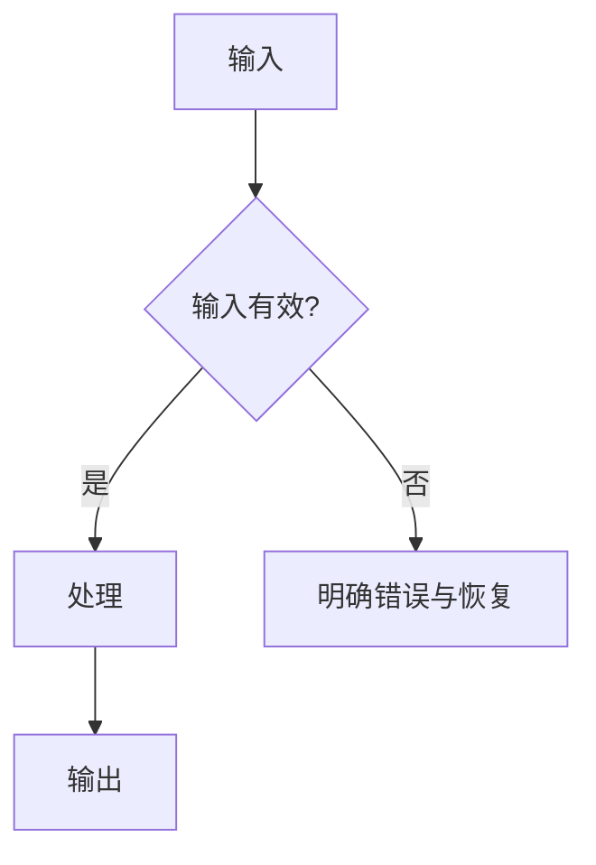

# <软件/模块名称> 软件需求规格说明书

> 文档编号：
> 目标版本/基线：
> 状态：草案 / 评审中 / 已批准
> 编写/需求负责人：待定
> 技术、测试、用户代表：待定
> 最后更新：YYYY-MM-DD

## 文档控制

| 控制项 | 内容 |
|---|---|
| 文档编号 | SRS-<PROJECT>-001 |
| 当前版本 | v0.1 |
| 当前状态 | 草稿 / 评审中 / 已批准 |
| 目标版本/需求基线 |  |
| 决策负责人 |  |
| 配套设计/架构/测试文档 |  |
| 编码与时间约定 | UTF-8；需要持久化时间时写明时区约定 |

### 审批记录

| 角色 | 姓名 | 结论 | 日期 | 备注 |
|---|---|---|---|---|
| 需求负责人 | 待定 | 待审批 |  |  |

### 变更记录

| 版本 | 日期 | 变更内容 | 受影响的需求/接口/测试 | 决策人 |
|---|---|---|---|---|
| v0.1 | YYYY-MM-DD | 初稿 |  | 待定 |

## 1. 引言

### 1.1 编写目的

说明本文档要定义的软件范围、下游用途以及不承担的决策。

### 1.2 软件范围与系统边界

- 软件目标：
- 范围内：
- 范围外：
- 上游系统/输入：
- 下游系统/输出：

### 1.3 利益相关方与预期读者

| 角色 | 目标/责任 | 使用本文档的方式 |
|---|---|---|
|  |  |  |

### 1.4 假设、依赖与开放决策

| ID | 类型 | 内容 | 影响 | 负责人 | 关闭证据 | 状态 |
|---|---|---|---|---|---|---|
| Q-001 | 开放问题 |  |  | 待定 |  | 待处理 |

### 1.5 术语与缩略词

| 术语/缩写 | 定义 | 来源/备注 |
|---|---|---|
|  |  |  |

#### 1.5.1 统一代号说明

仅列出项目实际使用的代号，并说明英文全称、中文名称、规范性含义和使用边界。稳定编号不得因章节调整而复用或改义；必须明确区分 SRS 的 `INT-*` 接口需求与 SDD 的 `API-*` 设计接口。

| 代号 | 英文全称 | 中文名称 | 指代内容与使用规则 | 示例/边界 |
|---|---|---|---|---|
| FR | Functional Requirement | 功能需求 | 规定可观察行为、输入输出和失败行为 | FR-001 |
| DATA | Data Requirement / Data Contract | 数据需求/数据合同 | 规定语义、校验、所有权、生命周期和兼容性 | DATA-001 |
| INT | Interface Requirement | 接口需求 | 规定边界必须满足的输入、输出、错误、时序和版本合同 | INT-001；不等同于具体函数 |
| QUAL | Qualification Provision | 合格性规定 | 规定方法、环境、步骤、阈值和证据 | QUAL-001 |
| MOD / SM | Module / Submodule | 模块/子模块 | 组织责任与功能归属，必须追踪到规范性需求 | MOD-01 / SM-01-01 |
| API | Application Programming Interface | 设计接口 | SDD 中实现 INT 或内部端口的函数、路由、消息、文件或协议 | API-001；不是新增 SRS 行为 |

### 1.6 引用文档与标准

| ID | 名称 | 版本/日期 | 适用范围 | 状态/位置 |
|---|---|---|---|---|
| REF-001 |  |  |  |  |

## 2. 运行环境要求

| ID | 类别 | 要求/版本范围 | 来源与理由 | 验证方法 | 状态 |
|---|---|---|---|---|---|
| ENV-001 | 操作系统 |  |  |  | 拟议 |
| ENV-002 | 语言/运行时/编译器 |  |  |  | 拟议 |
| ENV-003 | 框架/第三方库 |  |  |  | 拟议 |
| ENV-004 | 硬件与资源 |  |  |  | 拟议 |
| ENV-005 | 宿主软件/部署/网络 |  |  |  | 拟议 |

## 3. 软件需求分析

### 3.1 系统能力与模块划分

| 模块ID | 名称 | 核心责任 | 输入 | 输出 | 不负责 | 依赖 |
|---|---|---|---|---|---|---|
| MOD-01 |  |  |  |  |  |  |

> 对每个模块复制并填写下面的“3.x 模块需求”完整区块。公共定义在系统级写一次，模块引用其 ID。

### 3.2 <模块名称>

#### 3.2.1 文档/模块概述

- 模块目标：
- 主要参与者：
- 责任边界：
- 前置条件：
- 依赖模块/外部系统：
- 主要失败边界：

#### 3.2.2 模块术语与缩略词

仅记录系统术语表中未覆盖的模块专用术语；无新增项时写“不适用，使用 1.5 的公共术语”。

#### 3.2.3 模块引用文档

仅记录模块特有引用；无新增项时引用 1.6，不写未经检查的“无”。

#### 3.2.4 数据词典

| DATA-ID | 名称 | 含义 | 类型/形状 | 单位/坐标系/编码 | 范围/空值 | 生产者/消费者 | 校验与异常行为 | 版本 |
|---|---|---|---|---|---|---|---|---|
| DATA-001 |  |  |  |  |  |  |  |  |

持久化说明：若本模块创建、修改、查询、迁移、归档或删除持久数据，应在数据词典和关联 `DATA-*` 需求中写清逻辑实体、业务字段、标识、关系/基数、必填与默认、状态/唯一性/完整性规则、事务可见结果、保留/归档/删除、审计、备份恢复和迁移结果；若不持久化，说明理由。除非已经是明确约束，不在 SRS 中固定物理表名、SQL 类型、索引或迁移脚本，而是把这些内容交由 SDD 逐模块落实。

#### 3.2.5 子模块

先说明子模块具体提供哪些功能，再列出承载这些功能的规范性需求。不要用“管理”“支持”“处理”等笼统词代替可观察行为。

| 子模块 ID/名称 | 责任 | 具体功能 | 输入 | 输出/失败边界 | 需求追踪 |
|---|---|---|---|---|---|
| SM-01-01 <名称> |  | 查询/创建/校验/状态变更/计算/导出/恢复等明确动作 |  | 正常结果、空/部分结果、拒绝、回滚或稳定错误 | FR-001 / DATA-001 / INT-001 / QUAL-001 |

关联规范性需求：

| ID | 优先级 | 来源 | 触发/前置条件 | 规范性需求（系统应……） | 输入/输出 | 失败与边界行为 | 依赖 | 状态 |
|---|---|---|---|---|---|---|---|---|
| FR-001 | 必须 |  |  |  |  |  |  | 拟议 |

要求：可以独立验收的行为分别编号；不得用“等”“灵活支持”“正确显示”代替边界和判据。

#### 3.2.6 用例与用例图

##### UC-001：<用例名称>

| 字段 | 内容 |
|---|---|
| 目标 |  |
| 主要/次要参与者 |  |
| 前置条件 |  |
| 触发 |  |
| 后置条件 |  |
| 关联需求 | FR-001 |

主成功流程：

1.
2.

备选与异常流程：

| 分支 | 触发条件 | 系统行为 | 恢复/最终状态 | 错误码或提示 |
|---|---|---|---|---|
| A1 |  |  |  |  |

#### 3.2.7 操作/处理流程

用文字补充流程图无法表达的状态、并发、取消、超时、重试和回滚规则，并引用对应需求 ID。

#### 3.2.8 接口描述

| INT-ID | 接口/调用 | 提供者→使用者 | 输入合同 | 输出/副作用 | 错误合同 | 时序/并发/幂等 | 版本与兼容 | 关联需求 |
|---|---|---|---|---|---|---|---|---|
| INT-001 |  |  |  |  |  |  |  |  |

需要时补充精确签名、协议、文件格式或消息 Schema；不得仅罗列“支持某接口”。

#### 3.2.9 非功能性需求

| ID | 类别 | 参考环境/负载 | 刺激与操作 | 指标与阈值 | 测量方法 | 状态 |
|---|---|---|---|---|---|---|
| NFR-001 | 性能 |  |  |  |  | 拟议 |
| NFR-002 | 可靠性/恢复 |  |  |  |  | 拟议 |
| NFR-003 | 安全/安全性 |  |  |  |  | 拟议 |
| NFR-004 | 可维护/兼容 |  |  |  |  | 拟议 |

#### 3.2.10 设计、实现与实验约束

| ID | 固定约束 | 来源/决策人 | 理由 | 适用范围 | 关联需求/接口 | 合规证据 | 状态 |
|---|---|---|---|---|---|---|---|
| CON-001 |  |  |  |  |  |  | 拟议 |

将推荐方案放入设计文档；只有被合同、宿主环境、兼容性或批准决策固定的内容才写成约束。

科研、仿真、数据或实验型软件还应说明可复现性、数据来源、随机种子、精度/容差、人工确认和“不得外推结论”等实验边界；不适用时写明理由。

#### 3.2.11 合格性规定

| QUAL-ID | 关联需求 | 方法 | 环境/前置条件 | 测试数据/夹具 | 步骤或分析 | 预期结果/通过阈值 | 留存证据 | 状态 |
|---|---|---|---|---|---|---|---|---|
| QUAL-001 | FR-001 | 测试 |  |  |  |  |  | 拟议 |

方法使用检查、分析、演示或测试。必须包含正常、边界和失败样例；不能只写“测试该模块”。

## 4. 系统级接口与数据一致性

记录跨模块共享数据、公共错误、单位/坐标系、事务、状态同步和接口组合规则。

## 5. 系统级非功能要求

记录不能由单一模块独立承担的性能、资源、安全、可靠性、可用性、可维护性和兼容性目标。

## 6. 系统级设计与实现约束

汇总公共 `CON-*`，并区分已批准约束、待决策项和非规范性建议。

## 7. 合格性与验收计划

### 7.1 资格方法与环境

### 7.2 需求—验证追踪矩阵

| 需求ID | 来源 | 模块/用例 | 数据/接口/约束 | QUAL-ID | 证据位置 | 状态 |
|---|---|---|---|---|---|---|
| FR-001 |  | MOD-01 / UC-001 | DATA-001 / INT-001 | QUAL-001 |  | 拟议 |

### 7.3 未覆盖项

| 需求/测试 | 缺口 | 影响 | 负责人 | 关闭条件 | 状态 |
|---|---|---|---|---|---|
|  |  |  | 待定 |  | 待处理 |

### 7.4 功能—设计—用户手册—证据映射

| 功能ID/用户结果 | PRD/SRS需求 | MOD/SM/API/DATA-DES | 用户手册章节/步骤 | UAT/QUAL | 实际证据与状态 |
|---|---|---|---|---|---|
| F-001 /  | FR-001 | MOD-01 / UC-001 / API-001 |  | QUAL-001 | 未执行 |

## 8. 风险与开放问题

| ID | 类型 | 内容 | 影响范围 | 建议 | 决策人 | 所需证据 | 状态 |
|---|---|---|---|---|---|---|---|
| Q-001 | 开放问题 |  |  |  | 待定 |  | 待处理 |

## 9. 需求质量检查

- [ ] 所有规范性需求有稳定 ID、来源、状态和验证映射。
- [ ] 文档控制、审批、变更记录、目标基线和相关文档状态一致，未把编辑完成写成批准。
- [ ] 已定义项目使用的代号及边界，尤其区分 INT 需求合同和 API 设计实现。
- [ ] 术语、数据名称、单位、坐标系和接口名称前后一致。
- [ ] 每个模块均包含概述、术语、引用、数据词典、子模块、用例图、流程、接口、非功能要求、约束和合格性规定。
- [ ] 每个子模块有稳定 ID、责任、具体功能、输入、输出/失败边界和需求追踪。
- [ ] 用例覆盖主流程、无效输入、依赖失败、取消/超时和恢复（按风险适用）。
- [ ] 接口写明输入、输出、错误、时序、状态和兼容性，而非只列功能名称。
- [ ] 非功能要求包含参考环境、量化阈值和测量方法。
- [ ] 设计/实现约束有来源，不把推荐技术伪装成需求。
- [ ] 每项需求至少对应一项合格性方法和留存证据。
- [ ] 需求—验证追踪双向完整；未覆盖需求和无需求来源的测试均已显式列出。
- [ ] 每个主要用户功能均能双向追踪到用户手册章节/步骤、设计责任、UAT/QUAL 和实际证据状态。
- [ ] 拟议、已批准、已实现、测试通过、浏览器已观察、验收通过、正式接受等状态没有混用。
- [ ] 图与文字使用同一术语，并覆盖相同分支。
- [ ] 不适用项有理由；未知项有负责人、所需证据和关闭条件。
